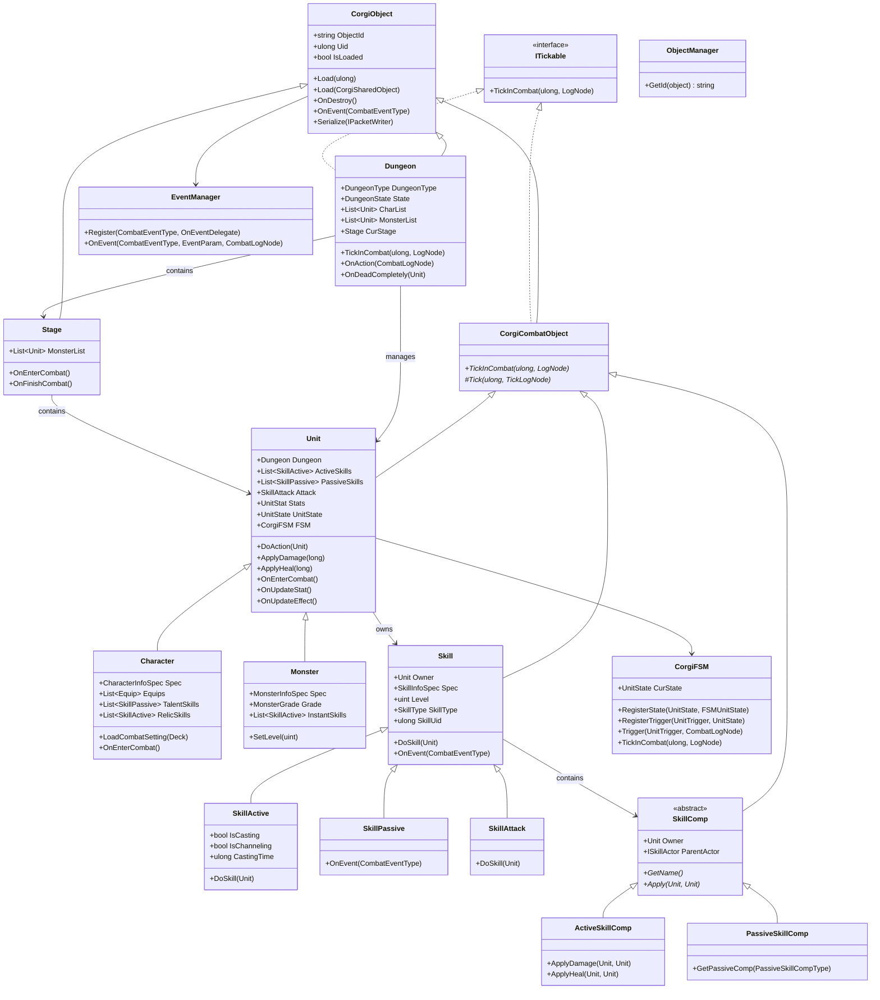
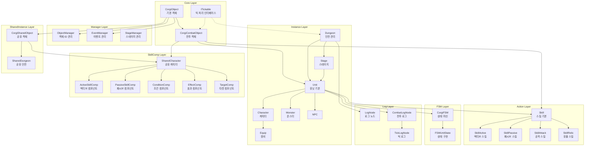
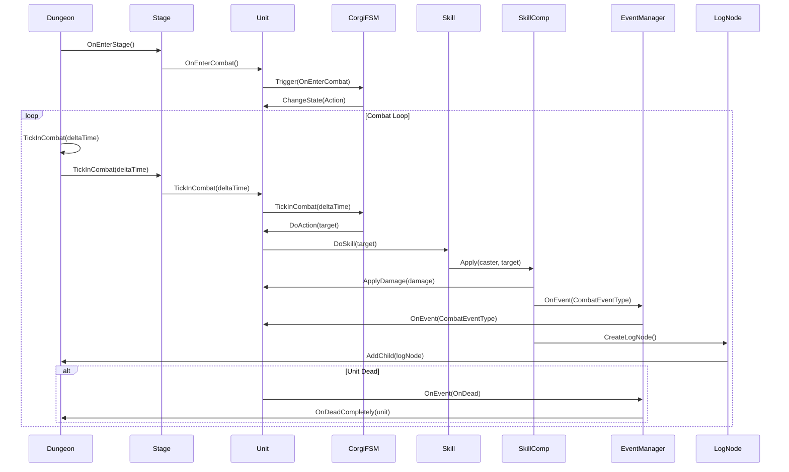
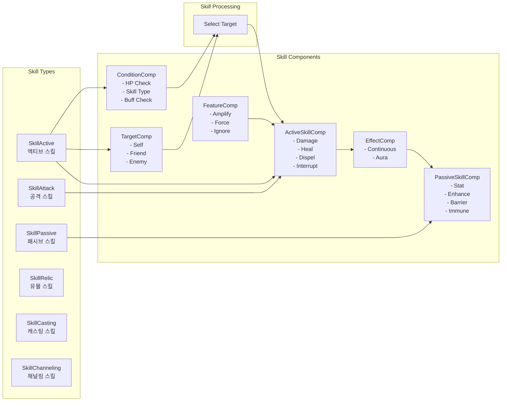
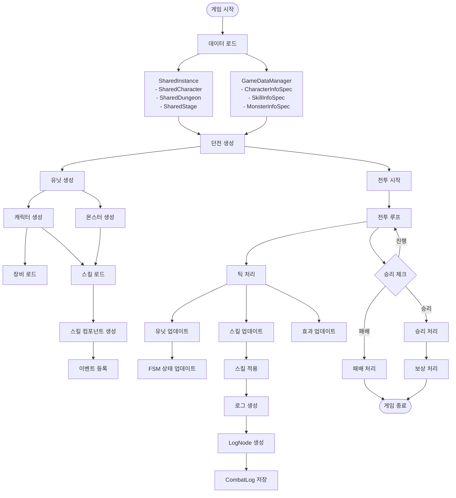
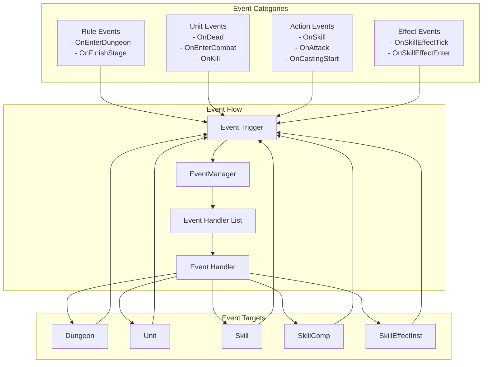
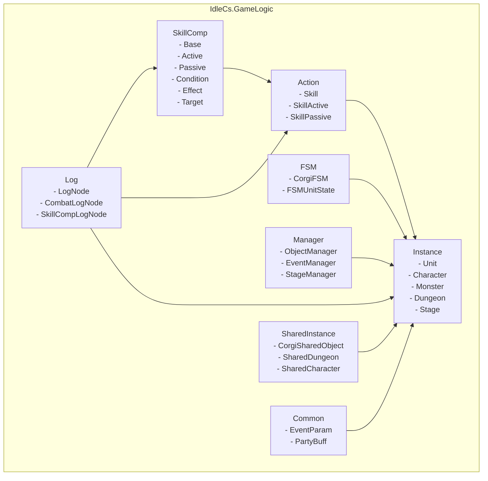

# GameLogic Architecture Diagram

## 1. 클래스 계층 구조 (Class Hierarchy)

## 2. 시스템 모듈 구조 (System Module Architecture)

## 3. 전투 시스템 플로우 (Combat System Flow)

## 4. 스킬 시스템 구조 (Skill System Architecture)

## 5. 데이터 흐름도 (Data Flow Diagram)

## 6. 이벤트 시스템 구조 (Event System Architecture)

## 7. 패키지/네임스페이스 구조 (Package Structure)

## 주요 아키텍처 특징

### 1. 객체 계층 구조
- **CorgiObject**: 모든 게임 객체의 기본 클래스 (ID 관리, 직렬화)
- **CorgiCombatObject**: 전투 관련 객체 (틱 처리)
- **Unit**: 전투 유닛 (캐릭터, 몬스터의 기본 클래스)

### 2. 컴포넌트 시스템
- **SkillComp**: 스킬을 모듈화된 컴포넌트로 구성
  - ActiveSkillComp: 데미지, 힐 등 즉시 효과
  - PassiveSkillComp: 스탯, 방어막 등 지속 효과
  - ConditionComp: 조건 체크
  - TargetComp: 타겟 선택
  - EffectComp: 지속 효과 관리

### 3. 상태 머신 (FSM)
- **CorgiFSM**: 유닛의 상태를 관리 (Idle, Moving, Action, Casting, Dead 등)

### 4. 이벤트 시스템
- **EventManager**: 이벤트 기반 프로그래밍으로 느슨한 결합 구현
- 다양한 CombatEventType으로 전투 이벤트 처리

### 5. 로그 시스템
- 계층적 로그 구조 (LogNode -> CombatLogNode -> SkillCompLogNode)
- 모든 전투 액션을 로그로 기록하여 재현 가능

### 6. 틱 기반 시스템
- **ITickable**: 모든 전투 객체가 틱 단위로 업데이트
- Dungeon -> Stage -> Unit -> Skill 순으로 틱 전파
